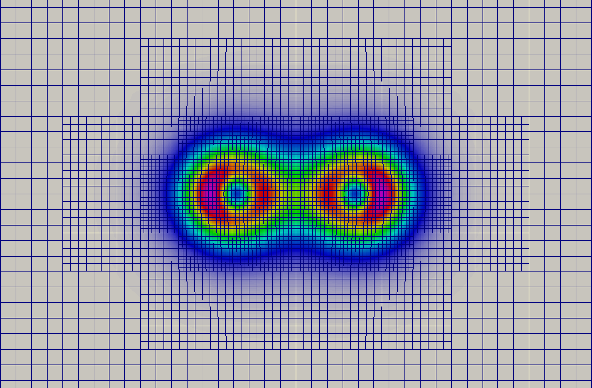

DFT-EFE : Density Functional Theory With Finite-Elements 
=======================================================

About
-----

DFT-EFE is a C++ code for materials modeling from first principles using Kohn-Sham density functional theory, developed by the `Computational Materials Physics Group <http://www-personal.umich.edu/~vikramg>`_ at University of Michigan.
It is based on adaptive finite-element discretization that handles all-electron and pseudopotential calculations in the 
same framework, and incorporates scalable and efficient solvers for the solution of the Kohn-Sham equations. Importantly, DFT-EFE can handle general geometries and boundary conditions, including periodic, semi-periodic and non-periodic systems. DFT-EFE code builds on top of the deal.II library for everything 
that has to do with finite elements, geometries, meshes, etc., and, through deal.II on p4est for parallel adaptive mesh handling.

.. toctree::
   :titlesonly:
   :caption: Using DFT-EFE

   Installing <installation>
   Running <running>
   references

.. toctree::
   :maxdepth: 2
   :caption: Examples

   examples/nitrogen
   examples/aluminium

.. toctree::
   :titlesonly:
   :caption: DFT-EFE API Reference

   params
   dftefe
   developing

* :ref:`genindex`

More information
----------------

 - See the official `website <https://sites.google.com/umich.edu/dftefe>`_ for information on code capabilities, appropriate referencing of the code, acknowledgements, and news related to DFT-EFE.
  
 - See Doxygen generated `documentation <https://dftefedevelopers.github.io/dftefe/>`_.

 - For questions about DFT-EFE, installation, bugs, etc., use the `DFT-EFE discussion forum <https://groups.google.com/forum/#!forum/dftefe-user-group>`_. 

 - For latest news, updates, and release announcements about DFT-EFE please send an email to dft-efe.admin@umich.edu, and we will add you to our announcement mailing list.
 
 - DFT-EFE is primarily based on the `deal.II library <http://www.dealii.org/>`_. If you have particular questions about deal.II, use the `deal.II discussion forum <https://www.dealii.org/mail.html>`_.
 
 - If you have specific questions about DFT-EFE that are not suitable for the public and archived mailing lists, you can contact the following:

    - Phani Motamarri: phanim@umich.edu
    - Sambit Das: dsambit@umich.edu
    - Vikram Gavini: vikramg@umich.edu 

 - The following people have significantly contributed either in the past or current and advanced DFT-EFE's goals: (All the underlying lists are in alphabetical order)

   - Principal developers  

     - Dr. Sambit Das (University of Michigan Ann Arbor, USA)
     - Dr. Phani Motamarri (University of Michigan Ann Arbor, USA)
    
   - Principal developers emeriti

     - Dr. Krishnendu Ghosh (University of Michigan Ann Arbor, USA)
     - Prof. Shiva Rudraraju  (University of Wisconsin Madison, USA)

   - Mentor

     - Prof. Vikram Gavini (University of Michigan Ann Arbor, USA)
         
 - A complete list of the many authors that have contributed to DFT-EFE can be found at `authors <https://github.com/dftefeDevelopers/dftefe/blob/publicGithubDevelop/authors>`_.    

License
-------

DFT-EFE is published under `LGPL v2.1 or newer <https://github.com/dftefeDevelopers/dftefe/blob/publicGithubDevelop/LICENSE>`_.
